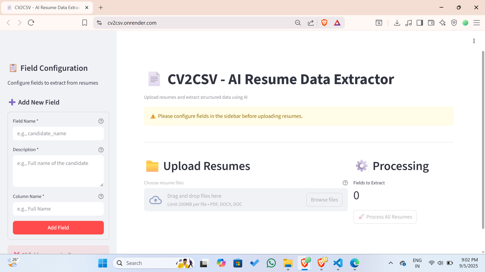
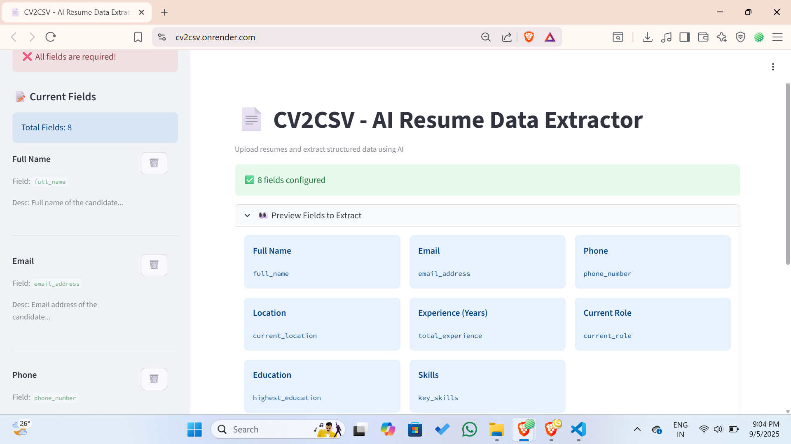
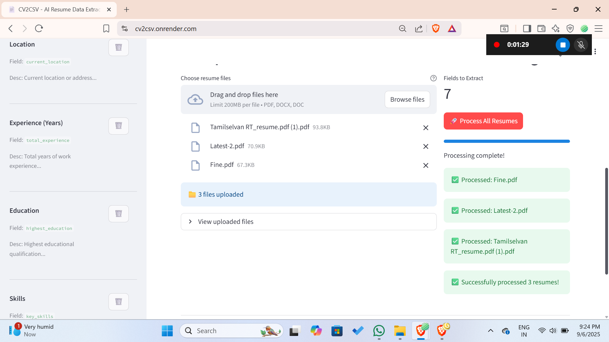
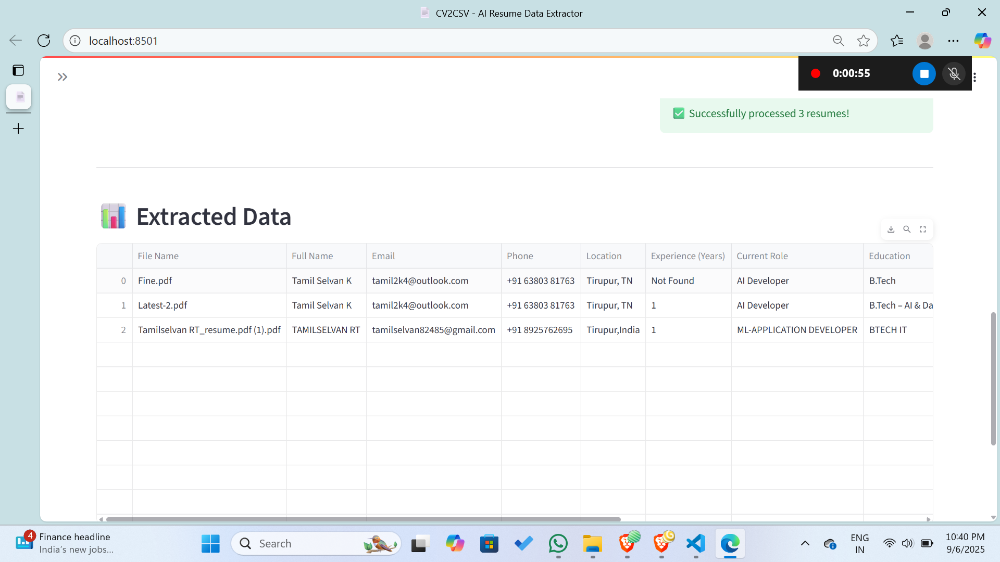
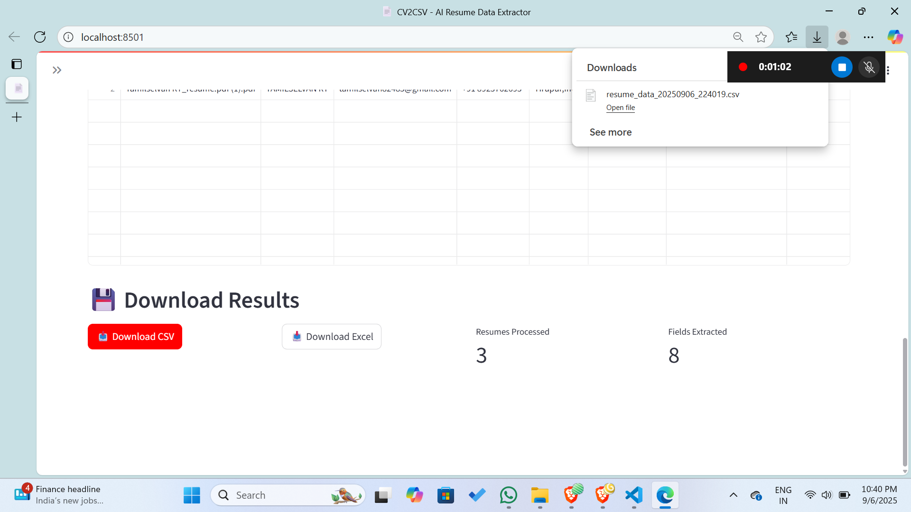

# 📄 CV2CSV – AI Powered Resume to CSV/Excel Extractor  

🚀 **CV2CSV** is an AI-powered tool that converts unstructured resumes (PDF, DOCX, DOC) into clean, structured data (CSV/Excel).  
Built with **Streamlit + Google Gemini AI**, it helps recruiters, HR teams, and colleges quickly extract candidate details like **name, email, phone, skills, education, and work experience** — without manual copy-paste.  

---

## 🌐 Try It Online  

👉 [cv2csv.onrender.com](https://cv2csv.onrender.com)  

No setup required — just upload your resume and see the results instantly! 🎉  

---

## 🎥 Demo  

👉 [Watch Full Demo Video](https://your-demo-video-link)  


---

<p align="center">
  
</p>

<p align="center">
  
</p>


<p align="center">
  
</p>


## ✨ Why CV2CSV?  

**AI-Powered Extraction** – Smart parsing with Google Gemini  
**Dynamic Fields** – Add your own custom fields  
**Batch Processing** – Upload multiple resumes at once  
**Ready Templates** – HR, Education, or Basic Resume fields  
**Export Anywhere** – Download results in CSV or Excel  
**Time Saver** – No more manual resume screening  

---

## 🖼️ Example Output  

| File        | Full Name   | Email            | Phone         | Skills        | Education   | Processed Date |
|-------------|-------------|------------------|--------------|---------------|-------------|----------------|
| resume1.pdf | John Doe    | john@email.com   | +91-9876543210 | Python, SQL  | B.Tech CSE | 2025-09-05     |
| resume2.docx| Jane Smith  | jane@email.com   | +91-9876501234 | ML, Django   | MBA        | 2025-09-05     |

---

<p align="center">
  
</p>

---

<p align="center">
  
</p>

---

## ⚡ Quick Start  

### 1️⃣ Clone the repo  
```bash
git clone https://github.com/classytamil/cv2csv.git
cd cv2csv
```

### 2️⃣ Install dependencies  
```bash
pip install -r req.txt
```

### 3️⃣ Add your Google API key  
Create a `.env` file in the project root:  
```env
GOOGLE_API_KEY=your_api_key_here
```

### 4️⃣ Run the app  
```bash
streamlit run app.py
```

---

## 🛠️ Tech Stack  

- **Streamlit** – Web App Framework  
- **Google Gemini AI** – Resume understanding  
- **PyPDF2 / python-docx** – Text extraction  
- **Pandas + OpenPyXL** – Data formatting & export  

---

## 📌 Use Cases  

- 🎓 **Colleges** – Auto-collect student resume data  
- 💼 **HR Teams** – Fast screening of job applicants  
- 🚀 **Startups** – Build candidate databases quickly  

---

## 📂 Project Structure  

```
cv2csv/
│── app.py              # Main Streamlit app
│── cv2con.py           # Resume text extractors
│── requirements.txt    # Dependencies
│── .env.example        # API key example
│── assets/             # Images & demo files
│    ├── 1.png
│    ├── banner.png
│── README.md
```

---

## 🤝 Contributing  

Pull requests are welcome. If you’d like to suggest new field templates or features, open an issue 🚀  

---

## 📜 License  

MIT License – free to use, share, and improve.  
